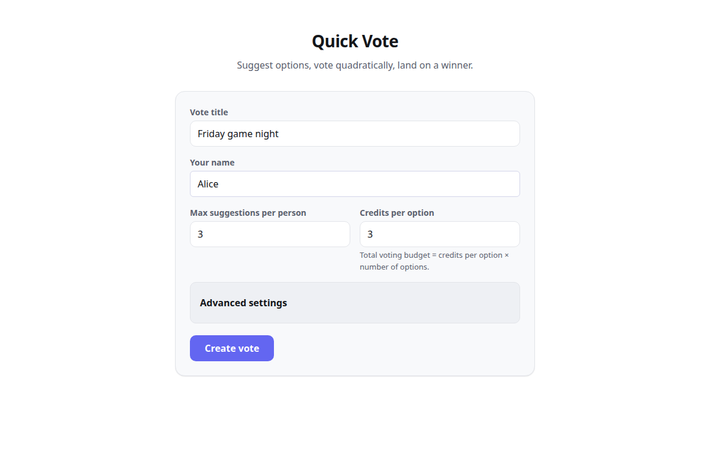
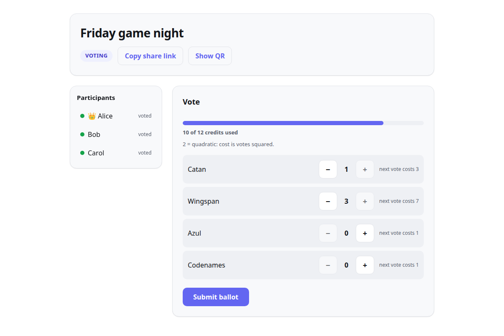
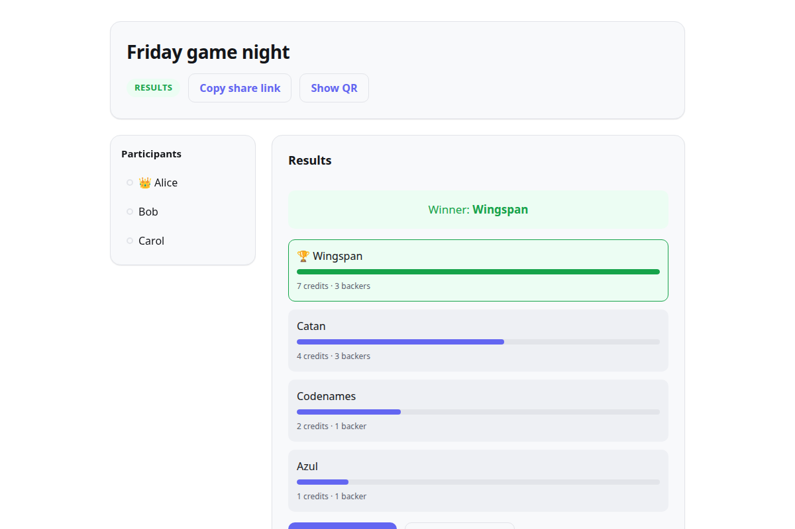

# Quick Vote


A small, self-hostable web app for deciding between options (board games, movies,
lunch spots — anything) using **quadratic voting**. One person creates a vote and
shares a link; everyone suggests options, votes with a shared credit budget, and
sees a scored result with veto, tiebreak, and re-vote mechanics.

It ships as a **single container**: a Go binary that embeds a React SPA and keeps
all state in one SQLite file. One port, one volume, no external services.

**Live demo:** <https://vote.aakster.net> — a public instance; anyone with a
link can see a vote, and votes are deleted after 90 days without activity.

### What is quadratic voting?

Everyone gets the same budget of credits, and putting `v` votes on one option
costs `v²` credits. Spreading support across several options is cheap;
stacking it all on one gets expensive fast (1 vote costs 1, 3 votes cost 9).
So a small group that cares a lot about an option can still move the result,
but no single voice can dominate it — you learn how strongly people feel, not
just which option they'd pick.

| Create | Vote | Results |
|---|---|---|
|  |  |  |

## Quick start

```sh
docker compose up -d
```

Then open <http://localhost:8080>, create a vote, and share the room link
(`/v/<slug>`) with your group. State lives in the `quickvote-data` volume
(`/data/quickvote.db` inside the container).

To run the image directly instead of Compose:

```sh
docker build -t quickvote .
docker run -d -p 8080:8080 -v quickvote-data:/data quickvote
```

## How it works

Three phases move in order: **suggesting → voting → results**.

1. **Suggesting** — participants add options (subject to a per-user cap).
   Anyone can mark themselves "done suggesting" at any point (even with zero
   suggestions) — it doesn't stop them adding or deleting more afterwards, but
   feeds the `all-done` advance rule below.
2. **Voting** — everyone gets a shared budget of `credits per option × number of
   options`. Casting `v` votes on one option costs `v` raised to the vote's
   cost-scaling exponent (2 = quadratic by default, so spreading support is
   cheap and piling onto one option is expensive; 1 = linear; up to 4 for a
   much steeper penalty). You can resubmit your ballot until the phase ends.
   If vetoes are enabled, a voter can spend a flat credit cost to explicitly
   veto an option instead of voting for it.
3. **Results** — each option's score is the sum of votes cast on it. Options
   below the survival threshold, or explicitly vetoed by anyone, are
   eliminated; the highest surviving score wins, with ties resolved by the
   configured tiebreaker. The `runoff` tiebreaker instead reopens voting on
   just the tied options (ballots cleared) and resolves a second tie with its
   fallback rule, guaranteeing an outcome after one extra round. Anyone can
   call for a re-vote; once enough people do, ballots clear and the room
   returns to voting.

Phase changes and every other update are pushed live over a WebSocket, so all
open browsers stay in sync.

### Creator controls

The creator can also, at any time:

- **Remove a participant** — their suggestions (during the suggesting phase)
  and ballot are wiped and their session stops working; their browser returns
  to the join screen with a "no longer in this vote" notice, from which they
  can join again as a new participant while the vote is open.
- **Delete any suggestion** during the suggesting phase (everyone else can
  delete only their own).
- **Close the vote** — the room becomes read-only for everyone, including the
  creator, and any running phase timer is cancelled. **Reopen** lifts that;
  the timer does not come back, so the phase continues under manual control.
- **Start another vote with the same group** — creates a follow-up vote
  (same settings by default) with every current participant already in it.
  Each carried-over participant's browser follows once: immediately if it has
  the room open, otherwise on its next visit to the old vote. After that, and
  for everyone else (spectators, people who join the old vote later), the
  old room shows a banner linking to the new vote. Removing someone from the
  old vote after the handoff doesn't remove their seat in the new one (remove
  them there too if needed); it only stops a browser that hadn't followed yet
  from following.

### Sharing

- **QR code** — "Show QR" in the room header renders the room link as a QR
  code (generated in the browser) for people in the same room as you.
- **Results page** — `/v/<slug>/results` is a read-only view of the results,
  safe to share with people who aren't in the vote.
- **CSV download** — the results screen links to
  `/api/votes/<slug>/results.csv`: one row per option with rank, option,
  score, backers, vetoes, eliminated and winner. Totals only; individual
  ballots are never exported (or shown to anyone but their owner).

Votes are stored in SQLite and deleted automatically after 90 days without activity
(configurable with `QV_RETENTION_DAYS`; `0` keeps them forever). Any change to
a vote — joining, suggesting, voting, a phase change, closing — counts as
activity; just viewing it doesn't. Until then a
vote's room stays reachable at its `/v/<slug>` link, and each browser also
keeps a local "recent votes" list (in `localStorage`, not synced anywhere) so
you can find your way back to rooms you created or joined without keeping the
link.

## Settings glossary

Set at creation time (the last few live behind an "Advanced" fold):

| Setting | Default | Meaning |
|---|---|---|
| **Title** | required | Name of the vote, e.g. "Friday game night". |
| **Max suggestions per user** | 3 | Cap on how many options each participant may add (1–20). |
| **Credits per option** | 3 | Budget multiplier. Total budget = this × number of options. Higher = more expressive ballots. |
| **Suggestion-phase advance rule** | manual | `manual` (creator advances), `count:N` (N distinct participants have each submitted at least one suggestion), `suggestion-count:N` (N total suggestions submitted, by anyone), or `all-done` (every current participant has marked themselves "done suggesting"). |
| **Voting-phase advance rule** | all-voted | `manual` or `all-voted` (auto-advance once every current participant has submitted a ballot). |
| **Survival threshold** | 0 | Minimum total votes an option needs to survive (its score is the sum of the votes cast on it). The default `0` disables the threshold, so every non-vetoed option stays in contention. Set `1` to eliminate options nobody voted for; raise it further to require broader support. |
| **Veto cost** | 0 (off) | Credits a voter spends to explicitly veto an option (ballot value `-1`) instead of voting for it. `0` disables vetoing. A vetoed option is eliminated no matter its score; results show "vetoed by N voter(s)", distinct from an under-threshold elimination. |
| **Vote cost scaling** | 2.0 (quadratic) | Exponent in the cost formula `ceil(votes ^ exponent)`, 1.0–4.0. `1` = linear cost, `2` = the original quadratic cost, higher values penalize concentrating votes on one option more steeply. |
| **Tiebreaker** | most-backers | How a tie for the top score is broken: `most-backers` (most distinct voters, then random), `random`, `creator` (results pause and the creator picks among the tied options), `earliest` (earliest-suggested tied option wins), or `runoff` (reopen voting on just the tied options, ballots cleared; a repeat tie resolves via the fallback below). |
| **Runoff fallback** | random | Only used when tiebreaker is `runoff`: how a tie *within* the runoff round itself is resolved (`most-backers`, `random`, `creator`, or `earliest` — never another runoff, so it always terminates). |
| **Re-vote threshold** | 33% | Percentage of current participants whose re-vote calls are needed to send the room back to voting (rounded up, minimum 1). |
| **Suggestion timer** | off | Optional duration; when it expires the suggestion phase auto-advances (held if fewer than 2 options exist). |
| **Voting timer** | off | Optional duration; when it expires the voting phase auto-advances and results are scored. |

The creator is a participant like everyone else and holds a separate creator
token (kept in the browser) that gates the creator controls: advancing the
phase, creator tiebreaks, removing participants and suggestions, close/reopen,
and starting the next vote. Settings cannot be changed after a vote is created
(a follow-up vote can use different ones).

## API

JSON over HTTP under `/api/votes`. Participants authenticate with
`Authorization: Bearer <sessionToken>` (returned when creating or joining);
creator-only endpoints additionally require `X-Creator-Token: <creatorToken>`
**and** the creator's own session. Errors are `{"error": "..."}` with 400
(validation), 401 (missing/invalid session), 403 (wrong creator token), 404
(unknown vote, participant or option), 409 (wrong phase, vote closed, or
state conflict), or 429 (rate limited). Close and reopen work whether or not
the vote is already closed (both are idempotent); every other write to a closed
vote returns 409 until the creator reopens it.

| Method | Path | Who | Purpose |
|---|---|---|---|
| `POST` | `/api/votes` | anyone | Create a vote: `{title, creatorName, settings?}` → `{slug, creatorToken, sessionToken, state}`. |
| `GET` | `/api/votes/{slug}` | anyone | Room state (personalized with a Bearer token). |
| `POST` | `/api/votes/{slug}/join` | anyone | Join: `{name}` → `{sessionToken, state}`. |
| `POST` | `/api/votes/{slug}/suggestions` | participant | Suggest an option: `{title}`. |
| `DELETE` | `/api/votes/{slug}/suggestions/{id}` | participant / creator | Delete your own suggestion, or (creator) any suggestion. Suggesting phase only. |
| `POST` | `/api/votes/{slug}/done-suggesting` | participant | Mark yourself done suggesting. |
| `PUT` | `/api/votes/{slug}/ballot` | participant | Submit your ballot: `{votes: {optionId: n}}`. |
| `POST` | `/api/votes/{slug}/advance` | creator | Advance the phase (`{winnerOptionId}` for a creator tiebreak). |
| `POST` | `/api/votes/{slug}/revote` | participant | Call for a re-vote. |
| `DELETE` | `/api/votes/{slug}/participants/{id}` | creator | Remove a participant and wipe their ballot (and suggestions, while suggesting). The creator can't be removed. |
| `POST` | `/api/votes/{slug}/close` | creator | Close the vote (idempotent); cancels any phase timer. |
| `POST` | `/api/votes/{slug}/reopen` | creator | Reopen a closed vote; no timer is re-armed. |
| `POST` | `/api/votes/{slug}/next` | creator | Start a follow-up vote with the same group: `{title, settings?}` → `{slug, creatorToken, sessionToken, state}` for the new vote. Settings default to this vote's. 409 if the vote is closed or already has a follow-up. |
| `GET` | `/api/votes/{slug}/results.csv` | anyone | Results as CSV (totals only). 409 until results are in. |
| `GET` | `/api/votes/{slug}/ws` | anyone | WebSocket for live room state (see below). |

Room state includes `closed` (bool), `next` (`{slug, title}` of the follow-up
vote, or `null`), and, for the requesting participant, `you.nextSessionToken`
so a browser can move into the follow-up vote without re-joining. The creator
also gets `you.nextCreatorToken`, but only when the request carries the
creator token too (`X-Creator-Token`, or `creatorToken` in the WebSocket auth
message): a creator session alone isn't enough to hand out a creator token.
Other participants' ballots are never included — only your own, as
`you.ballot`.

### WebSocket

Connect to `/api/votes/{slug}/ws`, then send an auth message as the **first**
message:

```json
{"type": "auth", "token": "<sessionToken>", "creatorToken": "<creatorToken>"}
```

`creatorToken` is optional: the creator's browser sends it so its snapshots
can include `you.nextCreatorToken`; everyone else leaves it out. An empty or
unknown `token` connects you as a spectator. Tokens go in this message rather
than the URL so they never end up in proxy or tunnel access logs. A
connection that doesn't send a valid auth message within 5 seconds is closed
with code 1008 (policy violation). After auth, the server pushes your
personalized room state as a JSON text message immediately and again after
every change.

## Development

Backend (Go 1.23+; the Docker build uses 1.27):

```sh
go run ./cmd/quickvote -addr :8080 -db ./quickvote.db
```

Frontend (Node 22.12+ or 24 LTS), with a dev server that proxies `/api`
(including the WebSocket) to the Go backend on `:8080`. WebSockets are
same-origin only, so start the backend with the dev server's origin allowed:

```sh
QV_ALLOWED_ORIGINS=http://localhost:5173 go run ./cmd/quickvote -db ./quickvote.db
cd web
npm install
npm run dev
```

Run the tests:

```sh
go test ./...        # backend: domain, store, and full-lifecycle API tests
cd web && npm test   # frontend: budget math, routing, session/next-vote handoff (Vitest)
```

### Configuration

Flags (with environment-variable fallbacks):

| Flag | Env | Default | Purpose |
|---|---|---|---|
| `-addr` | `QV_ADDR` | `:8080` | Listen address. |
| `-db` | `QV_DB` | `/data/quickvote.db` | SQLite database file path (its directory is created if missing). |
| `-retention-days` | `QV_RETENTION_DAYS` | `90` | Delete votes after this many days without activity (checked at startup and daily). `0` disables. |
| `-trusted-ip-header` | `QV_TRUSTED_IP_HEADER` | *(none)* | Header carrying the real client IP from your reverse proxy (`CF-Connecting-IP`, `X-Forwarded-For`, `X-Real-IP`). Rate limits are per client IP, so set this behind a proxy — but **only** if the server can't be reached except through that proxy, or clients can spoof it. |
| `-allowed-origins` | `QV_ALLOWED_ORIGINS` | *(none)* | Comma-separated extra origins allowed to open WebSockets (the page's own origin is always allowed). |

### Abuse limits

Quick Vote has no accounts, so it protects a public deployment with fixed
limits sized so a group sharing one IP (same Wi-Fi) won't hit them:

- Vote creation: 10 per IP (refilling 1/minute), plus a global cap.
- Other writes (join, suggest, vote, …): 120-request burst per IP, refilling 2/second.
- Participants: 100 per vote.
- Live-update WebSockets: 200 per vote, 50 per IP.
- Request bodies: 64 KiB. HTTP read/write timeouts guard against slow clients.

Public reads — room state (`GET /api/votes/{slug}`), `results.csv`, and the
results page — are deliberately not rate-limited: they're cheap, and a
results link may be opened by many people behind one IP. Only writes and
WebSocket connections are throttled.

Responses carry a strict Content-Security-Policy, `X-Frame-Options: DENY`, and
`Referrer-Policy: no-referrer` (room links are the only access control, so
they must not leak via `Referer`).

### Rebuilding the embedded frontend

The Go binary serves the SPA from `webembed/dist` via `//go:embed`. A
placeholder `index.html` is committed so `go build` works from a fresh clone
(the API works; the page just says the UI wasn't built). To
embed the real UI when building outside Docker:

```sh
cd web && npm run build
cp -r dist/. ../webembed/dist/
go build ./cmd/quickvote
```

The Docker build does this automatically in its multi-stage pipeline.

### Screenshots

The images in `docs/screenshots/` come from a throwaway local instance seeded
with sample data (`scripts/screenshots.mjs`; it builds the UI, starts a server
on `127.0.0.1:18090` with a temp database, and deletes it afterwards):

```sh
npx -y -p playwright@1.62.0 node scripts/screenshots.mjs
```

## Reverse proxy note

Quick Vote uses a WebSocket for live updates at `/api/votes/{slug}/ws`. If you
put it behind a reverse proxy, forward the WebSocket upgrade headers. For nginx:

```nginx
location / {
    proxy_pass http://127.0.0.1:8080;
    proxy_http_version 1.1;
    proxy_set_header Upgrade $http_upgrade;
    proxy_set_header Connection "upgrade";
    proxy_set_header Host $host;
    proxy_read_timeout 3600s;
}
```

Caddy and Traefik proxy WebSockets correctly with no extra configuration.

Behind any proxy, also set `QV_TRUSTED_IP_HEADER` (e.g. `X-Real-IP` with
`proxy_set_header X-Real-IP $remote_addr;` in nginx, or `CF-Connecting-IP` for
a Cloudflare Tunnel) so rate limits apply per client rather than to the proxy.

## License

[MIT](LICENSE).
